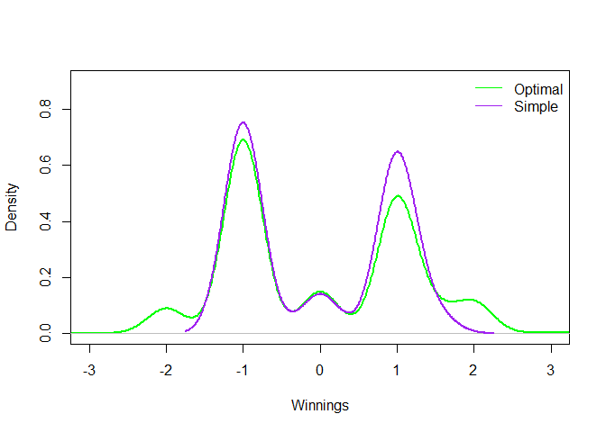
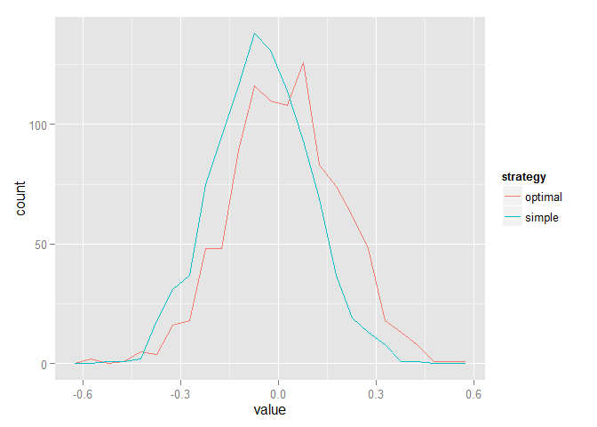

# Simulating BlackJack: A Case Study by Clay Moore
Clay Moore  
November 25, 2015  


```
## Loading required package: httpuv
## Loading required package: caTools
```

```
## [1] -0.0325
```

```
## [1] -0.0095
```

  

```
## Shuffling the shoe
```

##Question 1:
###In the winnings() function in the section called "Blackjack Basics", we chose to break the function down by the value of the dealer's cards first, and then the player's cards. What happens when we switch this order and start with the player's values? Is the function easier or harder to understand? Write this alternative version of the function and test it using the test code in the section called "Testing Functions" to make sure that your code works as expected.


```r
winnings = function(dealer, players) {
  if (players > 21) {
       # Blackjack
    1.5 * (players > dealer) +
    1 * (players == dealer)
  } else if (players > dealer & players != 0) {
       # Player wins against dealer and does not bust, dealer has lower value or busts
    1 * (players > dealer) 
  } else{
       # Player busts or loses to dealer
     -1 * (players < dealer | players) 
  }
}
```

The change that had to be made in the function was that the dealers value was not the focal point.  The players card value had to dictate what the overall result was.  The player solution is still built off of the dealer value, because that is how Blackjack works.  

##Question 2:
###How does the terse version of the winnings() function in the section called "Blackjack Basics" work? Is it consistent with the original version? Test this new version of the function with the test cases developed in the section called "Testing Functions". Is it easier to follow the logic in the first or second version of the winnings() function? Why? When do you think using code like this is appropriate?

The terse version of the function does not include any if or else functions, because it just takes all possibilities into one string and outputs the result. It works because it satisfys all possibilities in a TRUE or FALSE array, and then just multiplies the truth value by the value that respresents win,lose, or blackjack.  It holds the same results as the original function, and reports a push as a zero. I think the logic of the second function better because it is more conditional and more constricted.  The same function that took about 10 lines of code only takes three when the tense version is used, and does not follow "paths" of logic in the same way. However, if their were more inputs, I could see the expanded version of the function making more sense to use because it would result in a better pattern to follow.

##Question 3 and 4:
###Consider how you might add checks to the hit() , dd() and splitPair() functions (see the section called "Creating Functions for the Player's Actions") to ensure that they are being used properly. For example, add code to splitPair() so that an error message is returned if the player tries to split a hand when the two cards are not of equal value. Add other checks as well. (MODIFICATION: Only have to create function for SplitPair, and not other programs)


```r
splitPair = function(hand) {
  if (hand$cards[1] != hand$cards[2]) {
    return(c("Cannot splitPair, card combination does not match",hand))}
  else {
  list(
    new_hand(hand$shoe, 
             cards = c(hand$cards[1], hand$shoe(1)),
             bet = hand$bet),
    new_hand(hand$shoe, 
             cards = c(hand$cards[2], hand$shoe(1)),
             bet = hand$bet)
    )
  }
}
```

Unfortunately, it is hard to create checks for hit and dd due to it being allowed on any instance unless you have busted.  If you have busted, though, the program itself already takes care of making sure you cannot dd or hit on values of 21 or higher.  This was placed into the new functions, though it seems repetitive to have to do that.    

##Question 5:
###Implement the "draw-n()" method for the Shoe class of the section called "A More Accurate Card Dealer Shoe". This function has one input: n, which indicates how many cards should be drawn from the shoe. It returns a vector of n cards taken from the cards field of the Shoe object. This vector of cards begins at the position indicated by the pos fields. This method also increments pos by n so that we do not draw the same cards multiple times. It also calls the helper method decks_left() to see if it is time to reshuffle. If there is less than one deck in the shoe then it calls the shuffle() method to shuffle the cards.


```r
 draw_n = function(n) {
      if (decks_left() <= 1) shuffle()
    
      drawn = cards[pos + seq_len(n)]
      pos <<- pos + n
      drawn
    }
```

##Question 6:
###Implement the hi_low() function from the section called "Counting Cards". This function takes one input, which is a numeric vector cards, and it returns the Hi-Lo count (see Table 9.2, "Card Counting Strategies"). If you want an additional challenge, write the function without using an if statement or any loops. For example, consider taking advantage of the fact that the vector of cards is a numeric vector, and use that to subset into a vector of count values.


```r
hi_low = function(cards) {
  decks = ceiling(length(cards) / 52)
  sum(c(-1, 1, 1, 1, 1, 1, 0, 0, 0, -1)[cards]) / decks
}
```

##Question 7:
###Implement the "any-count()" function for counting cards (see the section called "Counting Cards"). This function has two arguments: a numeric vector cards which contains the cards played, and a numeric vector, strategy, which is of length 10 and contains the card values for one of the strategies in Table 9.2, "Card Counting Strategies". Modify "count-payoff()" to use "any-count()" . This may require modifying the function definition to accept a strategy argument.


```r
count_table = read.csv("C:/Users/Clayton/Documents/DataScience/Final/counts.csv", 
                       stringsAsFactors = FALSE, 
                       check.names = FALSE)

counts = base::split(count_table[, -1], count_table$strategy)
counts = lapply(counts, as.integer)

any_count = function(strategy, cards) {
  decks = ceiling(length(cards) / 52)
  sum(counts[[strategy]][cards]) / decks
}

count_payoff = function(shoe,strategy, n = 100) {
  gain = numeric(n)
  count = numeric(n)
  
  gain[1] = play_hand(shoe$draw_n, strategy_optimal)
  count[1] = 0
  
  for (i in 2:n) {
    count[i] = any_count(strategy,shoe$played())
    gain[i] = play_hand(shoe$draw_n, strategy_optimal) 
  }
  c(sum(gain), sum(gain * bet(count)))
}
```

##Question 8:
###Suppose a bet was larger than $1, say $4, how might the bet() function take this into consideration in deciding the size of the bet? Modify bet() (in the section called "Counting Cards") so that bets are integers, but utilize a standard bet size. What impact does this change have on other functions, e.g., winnings() ? Is there a need to modify any of the earlier code?


```r
bet = function(count) pmax(floor(count),1)
```

The bet function, as it stands, results in an integer that explains how much you should bet if you only bet 1 dollar.  However, in order to account for different sizes of wagers, you much then multiple the end result of the pmax by however much you imagine yourself betting.  The sample code that I came up with is below


```r
bet = function(count,wager) (pmax(floor(count), 1)*wager)
```

The wager part of the function indicates how much you are willing to wager no matter the outcome.  Then, as your count gos up (as well as your win probabilites), so does your final bet.

This change does not effect the winnings() function because the winnings() function has a multiplicative effect to what your bet would be.  Winning gives you the same as the amount bet (which is 2:1 odds), losing makes you lose your bet, and tieing the dealer does nothing.  

##Question 9:
###Implement other play options that are available in some games of blackjack, such as insurance and surrendering. Think about the "play-hand()" function: can you simply augment this function with code for these new actions, or do you need to fundamentally re-structure how the function works? See the section called "Strategies for Playing" for the "play-hand()" function.


```r
surrender=function(hand){
  winnings=-0.5*hand$bet
}

insurance=function(hand){
  if (dealer_cards(shoe)[1] == 1) {
    insurancebet = hand$bet*0.5
  }
  else {
    cat("Cannot make insurance bet. Dealer's first card must be an ace")
    return(hand$cards)
  }
  if (dealer_cards(shoe)[2] == 10) {
    hand$bet=hand$bet+insurancebet
  } else {
    hand$bet=hand$bet-insurancebet
  }
}
```

The surrender function is easy to replicate because no matter what your value is or what card section you are in, you just get half of your original bet.  The insurance function is a little more difficult because you only get to call an insurance when the dealers first card is an Ace.
The insurance command is more complicated, because it invovles multiple ways that you can change the bet that you have.  However, after figuring out how insurance bets can change your initial bet, it was relatively simple to augment the bet. It does not require changing the play-hand() function.

##Question 10: 
###A major simplification in our simulation is that we have effectively given the gambler an infinite amount of money. How do things change if we also account for ruin, i.e., the gambler running out of money?

The limitation that this stipulation brings is that you can not bet an infinite amount of times.  If you account for ruin, you would have to great an all encompassing program that would include either adding or subtracting the winnings result from an overall budget.  When the amount of that budget reaches zero, a stop command would have to occur that quits out of the program.  


##Question 11: 
###Can you make the code faster? Use profiling techniques to find the slow parts of the code. Also, consider how you might use vectorization to play multiple games at once.

Our longest function in term of time in this file is by far the replication functions.  This is because it takes a while to replicate a function a 1000 times, especially functions that are this complex. A very straightforward way of cutting down on this time would be to make it a comment rather than to run it, and trust the writer of the program that the results are true.  
Since most of this case study is writing functions, there is no real way to take off a considerable amount of time from the run time.  However, tips to reduce the time can be seen in simplfying functions to take in less vectors.  An example of this can be seen in the initial winnings() function.  Before there was about 11 lines of code, and after there was only 4 lines.  Due to the streamlined effort of the second winnings() function.


```r
 winnings1 = function(dealer, players) {
  if (dealer > 21) {
       # Dealer has blackjack, ties players with blackjack
    -1 * (players <= 21)
  } else if (dealer == 0) {
       # Dealer busts - all non-busted players win
    1.5 * (players > 21) +
      1 * (players <= 21 & players > 0) +
     -1 * (players == 0) 
  } else {
       # Dealer 21 or below, all player values > dealer win
    1.5 * (players > 21) +  
      1 * (players <= 21 & players > dealer) +
     -1 * (players <= 21 & players < dealer) 
  }
 }
winnings2 = function(dealer, players){
  (players > dealer & players > 21) * 1.5 + # blackjack
  (players > dealer & players <= 21) * 1 +  # win
  (players < dealer | players == 0) * -1    # lose
}
options(decimals=5)
system.time(winnings1(15,14))
```

```
##    user  system elapsed 
##       0       0       0
```

```r
system.time(winnings2(15,14))
```

```
##    user  system elapsed 
##       0       0       0
```

The system time for winnings2 should be less than winnings1, even if it is by such a miniscule amount that it is not seeable to the fifth decimal place.  The lesson to take from this is to have your code be tight and succinct, so that it cuts your program's run time.  
Vectorization can apply the function that you choose (new_shoe(), winnings(), play-hand()) to multiple different lengths, so that if you implement either of the strategies (simple or optimal), you can have it run over a list that you make and see multiple hands play out.  
